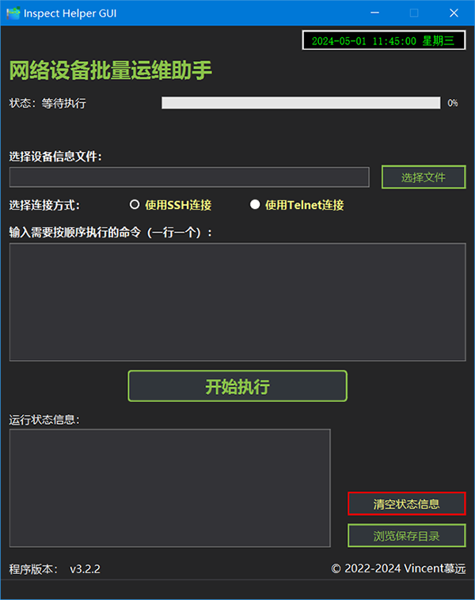

# Inspect Helper 简介
Inspect Helper是一个用于网络设备批量运维的工具类程序。该程序能够通过`SSH`或`Telnet`协议连接到目标网络设备（例如交换机、路由器等），然后自动执行您需要批量执行的命令行。命令执行后，目标设备返回的显示信息将保存在本程序所在目录下的`OutputFiles`目录中，以IP地址、主机名和时间命名。
此程序可以用于帮助运维管理员自动、批量获取局域网内的交换机、路由器设备配置信息。

# 功能介绍

* 此程序具有一个`GUI`界面；
* 支持通过`SSH`协议、`Telnet`协议来连接网络设备（例如交换机、路由器），目标网络设备需要开启相应协议的连接功能，且已设置了用户名和密码；
* 此程序从自身所在目录下的`DeviceInfo.xls`工作表中批量读取所需连接的设备的IP地址、用户名和密码信息；
* 此程序能够按顺序自动连接到目标网络设备，然后模拟用户输入预先设置好的命令行；
* 在连接到设备后，将会记录自动输入的命令以及目标设备返回的显示结果，并保存成文本文件。
 
 

# 使用方式

* 下载此程序压缩包并解压；
* 打开程序主目录下的`DeviceInfo.xls`这个Excel表格，按照表头的格式填写网络设备信息，填写完成后需要保存更改。其中“设备名”为非必填项，这个名称用于最后保存输出文件的命名，如果不填，最终文件名也会包含IP地址以用来区分；
* 运行程序主目录下的`Inspect-Helper.exe`；
* 在“选择设备信息文件”处，点击“选择文件”按钮，找到并选择上一步填写完成的“`DeviceInfo.xls`”文件；
* 在“选择连接方式”处，选择您希望使用的连接方式（`SSH`或`Telnet`，单选），同时目标设备必须能支持相应的连接方式；
* 在“输入需要按顺序执行的命令”的文本框中，输入您需要批量执行的命令，一行输入一条；
* 点击“开始执行”按钮，程序将开始执行任务。
在开始执行任务后，程序将依次连接“`DeviceInfo.xls`”表格中填写的设备，自动输入用户名和密码登录。每连接到1台设备后，程序将模拟用户自动按顺序输入填写好的命令，一次输入一条、每条命令输入后程序将等待5秒钟用来获取结果，之后再执行下一条命令，直到填写的命令全部在此设备上执行完毕后，程序会将输入记录、设备返回的显示信息保存成为一个`.txt`文本文件，该文件以设备名称+IP地址+日期时间来命名并保存在程序自身文件夹下的“`OutputFiles`”文件夹中。

# 举例说明

此程序在编写之初，是为了能够在日常运维时，快速、批量获取局域网内的交换机、路由器等网络设备的配置信息并保存在本地。
以此举例，例如我们需要此程序自动连接到一台交换机设备并自动获取配置信息，这台交换机的管理IP是“`172.16.1.1`”，已开启了“`SSH`”的远程管理功能，且设置了用户名为“`admin`”，密码为“`admin`”。
* 首先将登录信息写入到“`DeviceInfo.xls`”表格中并保存；
* 运行此程序，选择设备信息文件为“`DeviceInfo.xls`”，选择连接方式为“使用SSH连接”；
* 输入需要执行的命令为：
`terminal length 0` #此命令是为了让目标设备的终端回显内容能够完全显示全，而不需要按回车键或空格键来显示更多；
`show run` #此命令是查看交换机当前配置信息的命令。
* 然后点击“开始执行”按钮。程序会自动开始连接目标设备，同时下方的“运行状态信息”文本框中将会显示正在连接的设备IP和程序运行状态。连接后，程序将自动输入“`terminal length 0`”，等待5秒后自动输入“`show run`”，然后自动断开连接，并将输入的命令和目标设备返回的内容保存成文件。因为在输入“`show run`”后交换机就会回显当前的配置信息，所以在保存的结果文件中就能够看到这台交换机当前的配置了。
* 打开此程序所在文件夹下的“`OutputFiles`”文件夹，根据文件名中的IP地址、日期时间信息找到刚刚生成的`.txt`文本文件，打开后即可看到配置信息的内容。

# 注意事项

* 使用此程序前，需要先确保您希望连接的设备本身支持SSH或者Telnet的远程管理功能，且该功能已经开启并正确配置；
建议先使用平时登录设备的软件通过SSH或Telnet手动登录目标设备测试一下，如果无法正常登录，则本程序也不能够正常连接；
* 目标设备需要已经配置了具有远程登录权限的用户名和密码；
* 您的电脑上需要有能够编辑`.xls`表格文件的软件（例如Microsoft Excel或WPS）才能够正常编辑“`DeviceInfo.xls`”文件；
* “选择连接方式”中的“使用SSH连接”和“使用Telnet连接”同时只能选择1种。如果您网络中需要连接的设备既有SSH方式又有Telnet方式，则可以分两批录入到“`DeviceInfo.xls`”表格中。例如先将所有SSH方式的设备录入表格，运行软件时选择“使用SSH连接”，待完全执行完毕后，再重新录入Telnet方式的设备信息，选择“使用Telnet连接”再次运行一遍；
* “设备信息文件”表格也可以准备多份，一次使用一个，文件名也不需要固定为“`DeviceInfo`”，但文件格式必须是“`.xls`”格式（暂不支持.xlsx格式），且表格内容的“列”格式请不要进行修改（例如增加或删除有内容的一列），否则无法正常运行；
* “设置目标设备的终端回显内容能够完全显示完整”的命令，在不同品牌/型号/版本的设备上会有区别，例如：
`terminal length 0`
或者：
`screen-length 0`
（最后用`undo screen-length`来改回原来的配置）
如果不配置这一步，当您输入回显较长（例如`show run`）的命令，最后保存的回显结果可能是不完整的，例如最后显示了“--More--”；
* 在程序连接到目标设备后，程序窗口出现未响应状态是正常情况，此时程序还在运行，等待任务执行完毕后会恢复响应，请不要多次点击未响应的窗口，防止程序被操作系统关闭。

# 源码的使用

* 您的电脑上需要安装有Python环境，且已经正确添加到系统的环境变量（在安装Python环境软件时勾选“Add Python to Path”可自动配置环境变量）。本程序编写时使用的环境版本是“`Python 3.10.1`”，请使用此版本或更高版本的环境；
* 下载源码到本地，在源码主目录（“`requirements.txt`”所在的目录）下执行“`pip install -r requirements.txt`”来安装依赖的组件包；
* 执行“`python Inspect-Helper.py`”来运行程序（`Inspect-Helper.py`）。
* 程序的UI界面使用`PyQt5`制作。在上一步执行了“`pip install -r requirements.txt`”后，您的电脑上应该已经安装了`PyQt5`。在电脑上找到“`Qt Designer`”（例如从开始菜单的程序中查找），使用“`Qt Designer`”软件可打开“`Graphical_interface.ui`”文件来编辑界面。在编辑好之后，需要在命令行中执行“`pyuic5 -o .\Graphical_interface.py .\Graphical_interface.ui`”来将`.ui`文件转换为`.py`文件，程序运行时需要使用的是`.py`文件。
